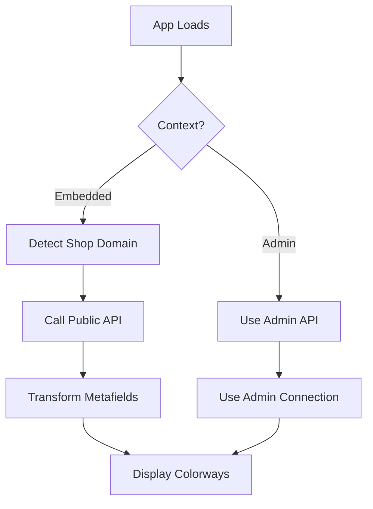

# Embedded App Setup for Public Colorways

This guide explains how to set up the embedded app to fetch colorways from Shopify without requiring admin authentication.

## Overview

When your app is embedded on a customer-facing page (not the Shopify admin), it needs to fetch colorway data through a public API endpoint rather than using admin credentials.

## Setup Steps

### 1. Environment Variables

Add the following environment variable to your Netlify deployment:

```bash
# For each shop you want to support, add a public access token
SHOPIFY_PUBLIC_TOKEN_YOURSHOPNAME_MYSHOPIFY_COM=your_public_access_token_here
```

**Important:** Replace `YOURSHOPNAME_MYSHOPIFY_COM` with your actual shop domain, converting special characters to underscores and making it uppercase.

**Example:**
- Shop: `kane-customs.myshopify.com`
- Environment variable: `SHOPIFY_PUBLIC_TOKEN_KANE_CUSTOMS_MYSHOPIFY_COM`

### 2. Create a Public Access Token

To create a public access token for your shop:

1. Go to your Shopify admin
2. Navigate to **Settings > Apps and sales channels**
3. Click **Develop apps**
4. Create a new app or edit an existing one
5. Configure the following scopes:
   - `read_products` - To read product data
   - `read_product_listings` - To read product metafields
6. Install the app and copy the access token
7. Add it to your Netlify environment variables

### 3. Embedding Options

The app will automatically detect the shop domain using these methods (in order):

#### Option A: URL Parameters (Recommended)
```html
<iframe src="https://your-app.netlify.app/?shop=your-shop.myshopify.com"></iframe>
```

#### Option B: Environment Variable
Set `VITE_SHOPIFY_SHOP_DOMAIN` in your build environment:
```bash
VITE_SHOPIFY_SHOP_DOMAIN=your-shop.myshopify.com
```

#### Option C: Auto-detection from Referrer
The app will try to detect the shop domain from the referrer URL when embedded in Shopify admin.

## API Endpoint

The public colorways are served via:
```
GET /.netlify/functions/public-colorways?shop=your-shop.myshopify.com
```

## How It Works

### 1. Context Detection
The app automatically detects if it's running in an embedded context vs admin context:

- **Embedded Context** (customer-facing): Uses public API endpoint
- **Admin Context** (Shopify admin): Uses admin API with full authentication

### 2. Data Flow



### 3. Fallback Strategy

1. **First**: Try to load dynamic colorways from Shopify
2. **Second**: Fall back to static colorways if API fails
3. **Always**: Show loading states and error handling

## Testing

### Local Testing
```bash
# Test the public API endpoint locally
curl "http://localhost:8888/.netlify/functions/public-colorways?shop=your-shop.myshopify.com"
```

### Production Testing
```bash
# Test the deployed endpoint
curl "https://your-app.netlify.app/.netlify/functions/public-colorways?shop=your-shop.myshopify.com"
```

## Troubleshooting

### No Colorways Loading
1. Check that the environment variable is set correctly
2. Verify the shop domain format
3. Ensure the access token has the right permissions
4. Check the browser console for error messages

### CORS Issues
The public API includes CORS headers for cross-origin requests:
```javascript
'Access-Control-Allow-Origin': '*'
'Access-Control-Allow-Methods': 'GET'
'Access-Control-Allow-Headers': 'Content-Type'
```

### Token Format
Make sure your access token:
- Starts with `shpat_` for private apps
- Has the correct scopes (`read_products`, `read_product_listings`)
- Is not expired

## Security Considerations

- Public access tokens should have minimal scopes (read-only)
- Only include scopes necessary for reading product data
- Consider implementing rate limiting if needed
- Monitor token usage in Shopify admin

## Multiple Shops

To support multiple shops, add environment variables for each:

```bash
SHOPIFY_PUBLIC_TOKEN_SHOP1_MYSHOPIFY_COM=token1
SHOPIFY_PUBLIC_TOKEN_SHOP2_MYSHOPIFY_COM=token2
SHOPIFY_PUBLIC_TOKEN_SHOP3_MYSHOPIFY_COM=token3
```

The app will automatically use the correct token based on the detected shop domain.
